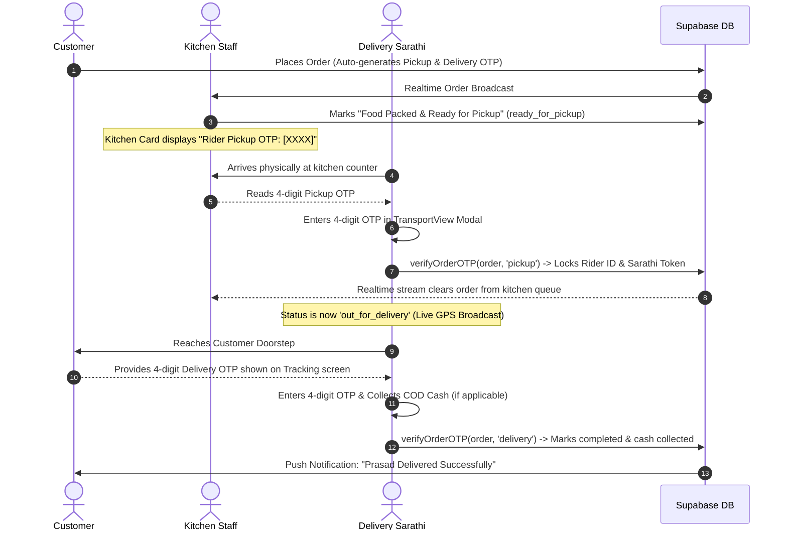

# 🌟 Foody Vrinda: System Architecture & Delivery Verification Updates

This document summarizes all enhancements implemented across the **Foody Vrinda** ecosystem, covering the **Two-Stage OTP Verification System**, **Kitchen Handover Lifecycle**, **Sarathi Daily Rotating Tokens**, and the **End-to-End Chain-of-Custody Audit Trail**.

---

## 📌 Executive Summary of System Enhancements

| Component | Previous State | Enhanced State | Impact |
| :--- | :--- | :--- | :--- |
| **Kitchen Pickup Flow** | Orders vanished upon clicking "Ready for Dispatch", hiding the Pickup OTP. | Orders remain visible in `ready_for_pickup` status with prominent **Rider Pickup OTP** badge until Sarathi physically verifies handover. | Zero handover confusion & 100% dispatch transparency. |
| **Rider Pickup Verification** | Direct status mutation without PIN prompt. | Interactive **4-Digit Kitchen Pickup OTP Modal** with PIN inputs, auto-advancing, error shake, and live verification via `verifyOrderOTP`. | Only the physical rider present at the counter can claim and dispatch the parcel. |
| **Rider Identification** | Generic rider name assigned blindly. | First-to-arrive rider enters OTP; system automatically binds their `rider_id`, `rider_name`, `rider_phone`, `rider_avatar`, and **Daily Sarathi Token (`SR-XXXX`)**. | Exact rider accountability & automatic duplicate claim prevention. |
| **Doorstep Delivery Verification** | Direct status mutation without PIN prompt. | Interactive **4-Digit Customer Delivery OTP Modal** with COD cash collection alert and doorstep OTP confirmation. | Guarantees prasad is delivered to the authentic customer before completing the trip. |
| **Audit Reports** | Manual database inspection needed. | One-tap **CSV / Excel Delivery Audit Report Export** (`exportDeliveryAuditReportCSV`) available in dashboard toolbar. | Instant compliance and operational auditing for Owners & Admins. |

---

## 🔄 Two-Stage OTP Handover Lifecycle



---

## 🛡️ Daily Rotating Sarathi Token (`getDailySarathiCode`)

To prevent rider impersonation and allow kitchen staff and customers to verify authentic Foody Vrinda Sarathis, each rider receives a **Daily Rotating 4-Digit Security Token**:

* **Format**: `SR-XXXX` (e.g. `SR-4092`, `SR-8120`)
* **Rotation**: Changes deterministically every 24 hours at 00:00 UTC based on `Rider ID + Date + Token Hash`.
* **Traceability**: Recorded in `foody_orders.sarathi_code` when the order is claimed at the kitchen counter.

---

## 📊 End-to-End Chain-of-Custody Audit Fields

Every order in `public.foody_orders` records an immutable audit ledger:

| Milestone | Field Name | Description |
| :--- | :--- | :--- |
| **Order Placement** | `created_at`, `customer_name`, `customer_phone`, `delivery_address` | Customer & order specifics |
| **Kitchen Packing** | `chef_id`, `chef_name`, `packed_at` | Staff member who prepared & packed the meal |
| **Pickup Handover** | `rider_id`, `rider_name`, `rider_phone`, `sarathi_code`, `picked_up_at`, `pickup_otp` | Verified physical rider and pickup timestamp |
| **Transit** | Leaflet GPS broadcaster | Throttled background GPS tracking |
| **Doorstep Delivery** | `delivered_at`, `delivery_otp`, `cash_status: 'collected'` | Handover timestamp, OTP, and COD ledger status |

---

## 🗄️ Supabase Database Migration DDL

Run the following SQL snippet in the **Supabase SQL Editor** to ensure all audit columns and status constraints exist:

```sql
-- 1. Ensure all Chain-of-Custody & Sarathi tracking columns exist
ALTER TABLE public.foody_orders ADD COLUMN IF NOT EXISTS rider_id TEXT;
ALTER TABLE public.foody_orders ADD COLUMN IF NOT EXISTS rider_name TEXT;
ALTER TABLE public.foody_orders ADD COLUMN IF NOT EXISTS rider_phone TEXT;
ALTER TABLE public.foody_orders ADD COLUMN IF NOT EXISTS rider_rating TEXT;
ALTER TABLE public.foody_orders ADD COLUMN IF NOT EXISTS rider_avatar TEXT;
ALTER TABLE public.foody_orders ADD COLUMN IF NOT EXISTS sarathi_code TEXT;
ALTER TABLE public.foody_orders ADD COLUMN IF NOT EXISTS chef_id TEXT;
ALTER TABLE public.foody_orders ADD COLUMN IF NOT EXISTS chef_name TEXT;
ALTER TABLE public.foody_orders ADD COLUMN IF NOT EXISTS packed_at TIMESTAMPTZ;
ALTER TABLE public.foody_orders ADD COLUMN IF NOT EXISTS picked_up_at TIMESTAMPTZ;
ALTER TABLE public.foody_orders ADD COLUMN IF NOT EXISTS delivered_at TIMESTAMPTZ;
ALTER TABLE public.foody_orders ADD COLUMN IF NOT EXISTS pickup_otp TEXT;
ALTER TABLE public.foody_orders ADD COLUMN IF NOT EXISTS delivery_otp TEXT;
ALTER TABLE public.foody_orders ADD COLUMN IF NOT EXISTS cash_status TEXT DEFAULT 'pending';

-- 2. Status Constraint Validation
DO $$ BEGIN
    ALTER TABLE public.foody_orders DROP CONSTRAINT IF EXISTS foody_orders_status_check;
    ALTER TABLE public.foody_orders ADD CONSTRAINT foody_orders_status_check 
        CHECK (status IN ('new', 'preparing', 'ready_for_pickup', 'out_for_delivery', 'completed', 'cancelled', 'returned'));
    
    ALTER TABLE public.foody_orders DROP CONSTRAINT IF EXISTS foody_orders_cash_status_check;
    ALTER TABLE public.foody_orders ADD CONSTRAINT foody_orders_cash_status_check 
        CHECK (cash_status IN ('none', 'pending', 'collected', 'settled'));
EXCEPTION WHEN OTHERS THEN NULL; END $$;

-- 3. Enable Realtime stream replication
ALTER TABLE public.foody_orders REPLICA IDENTITY FULL;
```

---

## 📁 Key File Links

* [Product Details Guide](file:///Users/sakhi/Code/Company/Projects/Foody-Vrinda/foody_vrinda_v3/ProductDetails/FOODY_VRINDA_SYSTEM_GUIDE.txt)
* [System Architecture HTML](file:///Users/sakhi/Code/Company/Projects/Foody-Vrinda/foody_vrinda_v3/ProductDetails/FOODY_VRINDA_SYSTEM_ARCHITECTURE.html)
* [Transport View (Rider Dispatch & OTP Modals)](file:///Users/sakhi/Code/Company/Projects/Foody-Vrinda/foody_vrinda_v3/src/views/TransportView.jsx)
* [Kitchen View (Kitchen Queue & Pickup OTP)](file:///Users/sakhi/Code/Company/Projects/Foody-Vrinda/foody_vrinda_v3/src/views/KitchenView.jsx)
* [Active Order Tracking Modal (Customer Delivery OTP)](file:///Users/sakhi/Code/Company/Projects/Foody-Vrinda/foody_vrinda_v3/src/components/ActiveOrderTrackingModal.jsx)
* [Supabase Core Service](file:///Users/sakhi/Code/Company/Projects/Foody-Vrinda/foody_vrinda_v3/src/supabase.js)

---

## 🧪 Build & Quality Verification

* **Web Bundle (`npm run build`)**: ✅ Passed with 0 compilation errors in `884ms`.
* **Capacitor Android (`npx cap sync android`)**: ✅ Successfully synced assets with 9 core plugins.
