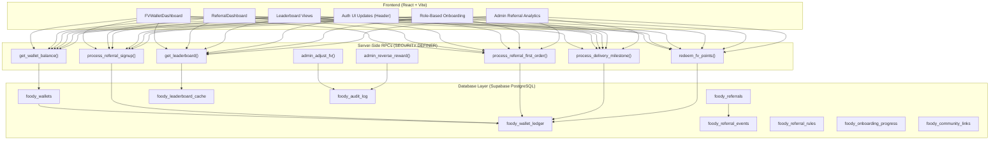

# 🏛️ Foody Vrinda — Digital Dynasty & FV Referral System
## Implementation Plan

> [!IMPORTANT]
> This is a large, multi-phase system. Implementation will follow the priority order (P0 → P1 → P2) exactly as specified, with zero existing functionality regression.

---

## Architecture Overview



---

## Phase Breakdown

### P0 — Foundation (Must Fix First)

| # | Task | Files Affected | Complexity |
|---|------|---------------|------------|
| 1 | **Login/Signup visibility for logged-out users** | [Header.jsx](file:///Users/sakhi/Code/Company/Projects/Foody-Vrinda/foody_vrinda_v3/src/components/Header.jsx) | Low |
| 2 | **Logged-out auth UI** (hide notifications, show Login button) | [Header.jsx](file:///Users/sakhi/Code/Company/Projects/Foody-Vrinda/foody_vrinda_v3/src/components/Header.jsx) | Low |
| 3 | **Role-based onboarding tutorial** | [InteractiveAppTutorial.jsx](file:///Users/sakhi/Code/Company/Projects/Foody-Vrinda/foody_vrinda_v3/src/components/InteractiveAppTutorial.jsx) | Medium |
| 4 | **DB Migration: FV Wallet & Ledger tables** | New SQL migration file | High |
| 5 | **DB Migration: Referral system tables** | New SQL migration file | High |
| 6 | **Atomic RPCs: signup reward, first-order, milestones** | New SQL migration file | High |
| 7 | **Referral code generation in auth sync trigger** | [supabase_schema.sql](file:///Users/sakhi/Code/Company/Projects/Foody-Vrinda/foody_vrinda_v3/Queries/supabase_schema.sql) | Medium |
| 8 | **FV Wallet service layer** (frontend service) | New `src/services/fvWalletService.js` | Medium |
| 9 | **Anti-fraud checks in RPCs** | Within SQL RPCs | High |

### P1 — Growth Features

| # | Task | Files Affected | Complexity |
|---|------|---------------|------------|
| 10 | **Customer Leaderboard** | New component + RPC | Medium |
| 11 | **Delivery Boy Leaderboard** | New component + RPC | Medium |
| 12 | **FV Rewards Dashboard** (replaces old RewardsModal) | [RewardsModal.jsx](file:///Users/sakhi/Code/Company/Projects/Foody-Vrinda/foody_vrinda_v3/src/components/RewardsModal.jsx) → New component | High |
| 13 | **WhatsApp Channel/Community links** | Within new FV Dashboard | Low |
| 14 | **Admin Referral Analytics** | [DeveloperView.jsx](file:///Users/sakhi/Code/Company/Projects/Foody-Vrinda/foody_vrinda_v3/src/views/DeveloperView.jsx) or [OwnerView.jsx](file:///Users/sakhi/Code/Company/Projects/Foody-Vrinda/foody_vrinda_v3/src/views/OwnerView.jsx) | High |

### P2 — Advanced

| # | Task | Complexity |
|---|------|------------|
| 15 | Referral quality tiers | Medium |
| 16 | Dynamic referral limits | Medium |
| 17 | Campaign bonuses | Medium |
| 18 | Ambassador system | High |
| 19 | Advanced fraud detection | High |
| 20 | Advanced network analytics | High |

---

## Database Schema Design

### New Tables

```sql
-- 1. foody_wallets (FV Point Wallet per user)
foody_wallets
├── user_id TEXT PRIMARY KEY (FK → foody_logged_users.id)
├── available_balance NUMERIC DEFAULT 0 CHECK (>= 0)
├── pending_balance NUMERIC DEFAULT 0 CHECK (>= 0)
├── lifetime_earned NUMERIC DEFAULT 0
├── lifetime_redeemed NUMERIC DEFAULT 0
├── referral_code TEXT UNIQUE NOT NULL
├── referred_by TEXT (FK → foody_wallets.user_id, nullable)
├── created_at / updated_at TIMESTAMPTZ

-- 2. foody_wallet_ledger (Immutable financial ledger)
foody_wallet_ledger
├── id BIGSERIAL PRIMARY KEY
├── user_id TEXT NOT NULL (FK → foody_wallets.user_id)
├── amount NUMERIC NOT NULL (!=0)
├── type TEXT NOT NULL ('earn','redeem','reversal','adjustment')
├── source TEXT NOT NULL ('referral_signup','referral_first_order','delivery_milestone_1','delivery_milestone_5','delivery_milestone_15','redemption','admin_adjustment','reversal')
├── reference_id TEXT (idempotency key, e.g. referral_id + event_type)
├── status TEXT DEFAULT 'available' ('pending','available','redeemed','reversed','expired')
├── metadata JSONB DEFAULT '{}'
├── created_at TIMESTAMPTZ DEFAULT NOW()
├── UNIQUE(reference_id) -- idempotency guarantee

-- 3. foody_referrals (Referral relationships)
foody_referrals
├── id TEXT PRIMARY KEY (uuid)
├── referrer_id TEXT NOT NULL (FK → foody_logged_users.id)
├── referred_user_id TEXT NOT NULL UNIQUE
├── referred_role TEXT DEFAULT 'customer'
├── status TEXT DEFAULT 'pending' ('pending','active','completed','fraudulent')
├── created_at / updated_at TIMESTAMPTZ

-- 4. foody_referral_events (Milestone tracking)
foody_referral_events
├── id BIGSERIAL PRIMARY KEY
├── referral_id TEXT NOT NULL (FK → foody_referrals.id)
├── event_type TEXT NOT NULL
├── reward_referrer NUMERIC DEFAULT 0
├── reward_referred NUMERIC DEFAULT 0
├── status TEXT DEFAULT 'pending' ('pending','credited','reversed')
├── processed_at TIMESTAMPTZ
├── created_at TIMESTAMPTZ DEFAULT NOW()
├── UNIQUE(referral_id, event_type) -- one reward per milestone

-- 5. foody_referral_rules (Configurable reward rules)
foody_referral_rules
├── id TEXT PRIMARY KEY
├── role TEXT NOT NULL ('customer','delivery')
├── event_type TEXT NOT NULL
├── referrer_reward NUMERIC NOT NULL
├── referred_reward NUMERIC NOT NULL
├── is_active BOOLEAN DEFAULT true
├── eligibility_window_hours INT (e.g. 24 for first-order)

-- 6. foody_onboarding_progress
foody_onboarding_progress
├── user_id TEXT PRIMARY KEY
├── role TEXT NOT NULL
├── steps_completed JSONB DEFAULT '[]'
├── is_complete BOOLEAN DEFAULT false
├── completed_at TIMESTAMPTZ
├── created_at / updated_at TIMESTAMPTZ

-- 7. foody_leaderboard_cache (Daily materialized)
foody_leaderboard_cache
├── id BIGSERIAL PRIMARY KEY
├── user_id TEXT NOT NULL
├── role TEXT NOT NULL ('customer','delivery')
├── display_name TEXT
├── avatar_url TEXT
├── available_fv NUMERIC DEFAULT 0
├── rank INT
├── snapshot_date DATE DEFAULT CURRENT_DATE
├── created_at TIMESTAMPTZ DEFAULT NOW()
├── UNIQUE(user_id, role, snapshot_date)

-- 8. foody_audit_log
foody_audit_log
├── id BIGSERIAL PRIMARY KEY
├── actor_id TEXT NOT NULL
├── action TEXT NOT NULL
├── target_type TEXT
├── target_id TEXT
├── old_state JSONB
├── new_state JSONB
├── reason TEXT
├── request_id TEXT
├── created_at TIMESTAMPTZ DEFAULT NOW()

-- 9. foody_community_links
foody_community_links
├── id TEXT PRIMARY KEY
├── type TEXT NOT NULL ('whatsapp_channel','whatsapp_community','telegram')
├── name TEXT NOT NULL
├── url TEXT NOT NULL
├── is_active BOOLEAN DEFAULT true
├── created_at / updated_at TIMESTAMPTZ
```

### Critical Constraints & Indexes

```sql
-- Idempotency
UNIQUE(reference_id) on foody_wallet_ledger
UNIQUE(referral_id, event_type) on foody_referral_events
UNIQUE(referred_user_id) on foody_referrals

-- Performance
INDEX on foody_wallet_ledger(user_id, status)
INDEX on foody_referrals(referrer_id)
INDEX on foody_referrals(referred_user_id)
INDEX on foody_leaderboard_cache(role, snapshot_date, rank)
INDEX on foody_audit_log(actor_id, created_at DESC)
```

---

## Server-Side RPCs (Security-Critical)

All reward logic runs as `SECURITY DEFINER` PostgreSQL functions. **Frontend never directly modifies wallets or ledger.**

### Core RPCs

| RPC | Purpose | Security |
|-----|---------|----------|
| `create_referral_wallet(user_id, referral_code_from_link)` | Creates wallet on signup, links referral | SECURITY DEFINER |
| `process_referral_signup(referral_id)` | Awards signup FV (5+5 for customer) | SECURITY DEFINER, Idempotent |
| `process_first_order_reward(order_id)` | Awards first-order FV (10+20 for customer) | SECURITY DEFINER, Idempotent, 24h check |
| `process_delivery_milestone(delivery_boy_id)` | Checks 1st/5th/15th delivery milestones | SECURITY DEFINER, Idempotent |
| `redeem_fv_points(user_id, amount)` | Atomic FV redemption with balance check | SECURITY DEFINER, Atomic |
| `get_wallet_dashboard(user_id)` | Returns wallet + recent transactions | RLS protected |
| `get_leaderboard(role, limit)` | Returns cached leaderboard | Public read (safe columns only) |
| `refresh_leaderboard()` | Daily cron to rebuild leaderboard cache | Service-role only |
| `admin_adjust_fv(admin_id, target_id, amount, reason)` | Admin manual adjustment | Admin-verified |
| `admin_reverse_reward(admin_id, ledger_id, reason)` | Reversal via counter-entry | Admin-verified |

### Reward Amount Matrix (Hardcoded in `foody_referral_rules`)

| Role | Event | Referrer FV | Referred FV |
|------|-------|-------------|-------------|
| Customer | Signup (phone verified) | +5 | +5 |
| Customer | First Order (24h window) | +10 | +20 |
| Delivery | Registration | 0 | 0 |
| Delivery | 1st Completed Delivery | +5 | +10 |
| Delivery | 5 Completed Deliveries | +20 | +25 |
| Delivery | 15 Completed Deliveries | +25 | +35 |

---

## Frontend Components

### Header Changes ([Header.jsx](file:///Users/sakhi/Code/Company/Projects/Foody-Vrinda/foody_vrinda_v3/src/components/Header.jsx))

```diff
 {/* Right: Actions Cluster */}
 <div className="flex items-center gap-1.5 sm:gap-2 shrink-0">
+  {/* Logged-Out: Show Login / Sign Up button */}
+  {!user && (
+    <button onClick={onToggleAuth} className="...login-btn-styles...">
+      Login / Sign Up
+    </button>
+  )}

   {/* Search - always visible */}
   <button onClick={onToggleSearch}>...</button>

-  {/* Notifications - always visible */}
-  <button onClick={onToggleNotifications}>...</button>
+  {/* Notifications - only for logged-in users */}
+  {user && (
+    <button onClick={onToggleNotifications}>...</button>
+  )}
 </div>
```

### New FV Rewards Dashboard (replaces [RewardsModal.jsx](file:///Users/sakhi/Code/Company/Projects/Foody-Vrinda/foody_vrinda_v3/src/components/RewardsModal.jsx))

```
FVRewardsDashboard.jsx
├── Wallet Balance Card (Available FV, ₹ value, Pending)
├── Referral Section (Code, Link, Share WhatsApp, Copy)
├── Referral Stats (Successful, Pending, Rank)
├── Transaction History (Scrollable ledger view)
├── Reward Rules Display (role-specific)
└── Leaderboard Preview
```

### Role-Based Onboarding (enhances [InteractiveAppTutorial.jsx](file:///Users/sakhi/Code/Company/Projects/Foody-Vrinda/foody_vrinda_v3/src/components/InteractiveAppTutorial.jsx))

```
Customer Flow: Welcome → Find Food → Order → Earn FV → Refer → Redeem
Delivery Flow: Welcome → Go Online → Accept → Deliver → Earnings → Refer
Restaurant Flow: Setup → Menu → Orders → Manage → Sales → Grow
```

---

## Security Model

### RLS Policies (New Tables)

| Table | anon | authenticated (self) | admin/service |
|-------|------|---------------------|---------------|
| `foody_wallets` | ❌ | SELECT own only | ALL |
| `foody_wallet_ledger` | ❌ | SELECT own only | INSERT (via RPC) |
| `foody_referrals` | ❌ | SELECT own only | ALL |
| `foody_referral_events` | ❌ | SELECT own only | INSERT (via RPC) |
| `foody_referral_rules` | SELECT | SELECT | ALL |
| `foody_leaderboard_cache` | SELECT (safe cols) | SELECT (safe cols) | ALL |
| `foody_audit_log` | ❌ | ❌ | SELECT, INSERT |
| `foody_onboarding_progress` | ❌ | SELECT/UPDATE own | ALL |

### Anti-Fraud Enforcement Points

```
1. Self-referral → REJECTED in create_referral_wallet()
2. Duplicate phone referral → REJECTED via UNIQUE(referred_user_id)
3. Double reward → REJECTED via UNIQUE(referral_id, event_type)  
4. Race conditions → Row-level locking in RPCs
5. Client-side balance manipulation → IMPOSSIBLE (RPC only)
6. Cancelled/test deliveries → Excluded in milestone count query
7. Monthly referral limit → Checked in process_delivery_milestone()
```

---

## Implementation Sequence

### Step 1: Database Migration SQL
Create `05_fv_dynasty_migration.sql` with all tables, indexes, RLS, RPCs, seed referral rules.

### Step 2: Auth Trigger Update
Extend `handle_auth_user_sync()` to auto-create wallet with unique referral code on signup.

### Step 3: Header UI Updates
Login/Signup visibility + notification hiding for logged-out users.

### Step 4: FV Wallet Service
`src/services/fvWalletService.js` — frontend service calling RPCs.

### Step 5: FV Rewards Dashboard Component
Replace old RewardsModal with full FV ecosystem dashboard.

### Step 6: Role-Based Onboarding
Enhance tutorial system with role-specific flows.

### Step 7: Leaderboards
Customer + Delivery partner leaderboard components + daily refresh RPC.

### Step 8: Admin Analytics Panel
Referral metrics, FV metrics, fraud signals in Owner/Developer views.

### Step 9: Integration Testing
Automated security verification checklist from the spec.

### Step 10: Build Verification
`npm run build` to ensure zero compilation errors.

---

## Estimated File Count

| Category | New Files | Modified Files |
|----------|-----------|---------------|
| SQL Migrations | 1 | 0 |
| Frontend Services | 1 | 0 |
| Frontend Components | 3-4 | 3-4 |
| Tests | 1 | 0 |
| **Total** | **6-7** | **3-4** |

---

> [!WARNING]
> **Schema Parity Rule**: Per AGENTS.md, when updating database schemas, both `foody_vrinda_v3` (web) and `foody_vrinda_app` (Flutter) must be updated simultaneously to maintain 100% schema parity. Flutter service files will need corresponding updates.

> [!CAUTION]
> The existing [RewardsModal.jsx](file:///Users/sakhi/Code/Company/Projects/Foody-Vrinda/foody_vrinda_v3/src/components/RewardsModal.jsx) uses **client-side localStorage** for coin balance — this is exactly the anti-pattern we're replacing with server-side FV wallet. The migration must be seamless.

---

**Ready to proceed with implementation?**
